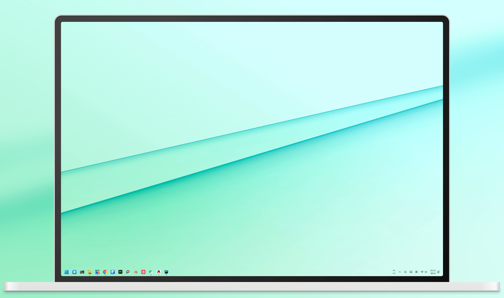

# Next.js + sharp 带壳截图合成



### 使用示例：

前提：设备安装有 Node.js

首先运行：`npm run install`，然后就可以使用了。

```
# 最短的生成命令：指定 原始截图&设备框图
node shadframe.js --screenshot=1.png  --mockup=tablet@3840-2560.png

# 全部生成命令
node shadframe.js --screenshot=1.png --mockup=tablet@3840-2560.png --background=background@3840-2560.png --radius=32 --save=output.png --quality=90
```

### 已有的设备框对应分辨率使用命令

```
# 1920*1080
# imac:
node shadframe.js --screenshot=1.png  --mockup=imac@1920_1080top90left90.png --top=90 -left=90 --quality=90

# studiodisplay:
node shadframe.js --screenshot=1.png  --mockup=studiodisplay1920_1080top90left90.png --top=90 --left=90 --quality=90

---

# 2560*1440
# imac:
node shadframe.js --screenshot=1.png  --mockup=imac@2560_1440top90left90.png --top=90 --left=90 --quality=90

---

# 2560*1600
# TabS9
node shadframe.js --screenshot=1.png  --mockup=tabs9@2560_1600.png --quality=90

# macbook16
node shadframe.js --screenshot=1.png  --mockup=macbook16@2560_1600.png --quality=90
---

# 3840*2560
# laptop:
node shadframe.js --screenshot=1.png  --mockup=laptop@3840-2560.png --background=background@3840-2560.png --quality=90

# surfacebook3
node shadframe.js --screenshot=1.png  --mockup=surfacebook3@3840-2560.png --background=background@3840-2560.png --quality=90

# surfacestudio2
node shadframe.js --screenshot=1.png  --mockup=surfacestudio2@3840-2560top125left128.png --top=125 --left=128 --quality=90

```

### 参数：

- --screenshot 原始截图
- --mockup 设备框图
- --background 背景图
- --radius 屏幕圆角 默认：16
- --top 顶部偏移像素
- --left 左侧偏移像素
- --save 保存文件名 默认：output.png
- --quality 质量 默认不压缩

### 自定义设备框

本工具合成原理：设备框中心刚好对齐原始截图的中心，不会影响截图的原尺寸，设备框只是作为背景居中叠加合成。

制作自己的设备框：用 Photoshop 打开原始截图后，使用剪裁工具按住alt沿中心扩大，将自己的设备框放进去刚好剧中框住截图，然后再用剪裁工具按住 alt 沿中心缩放到合适的尺寸，然后隐藏原始截图导出设备框图即可。如果不在中心，需要生成时使用 top 以及 left 沿左上角顶部偏移